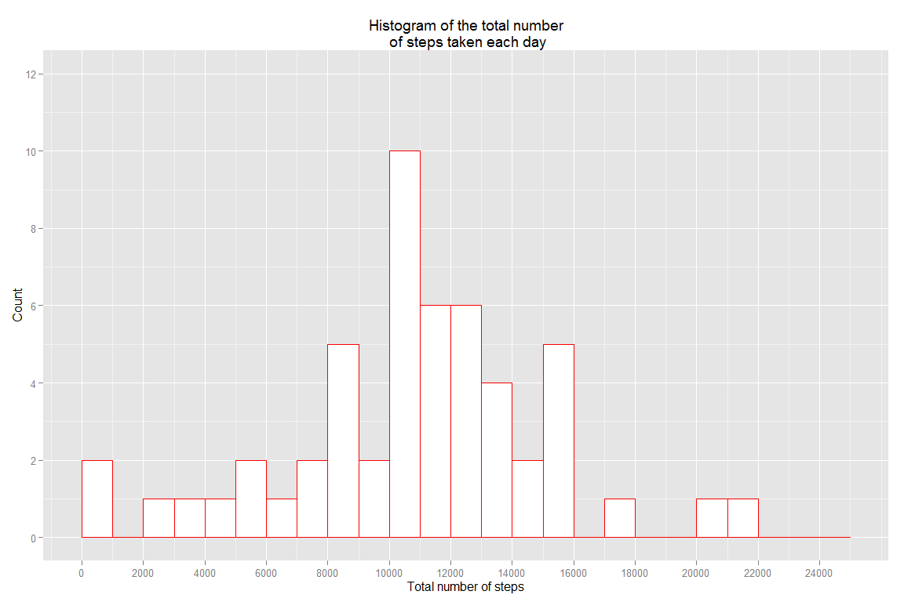
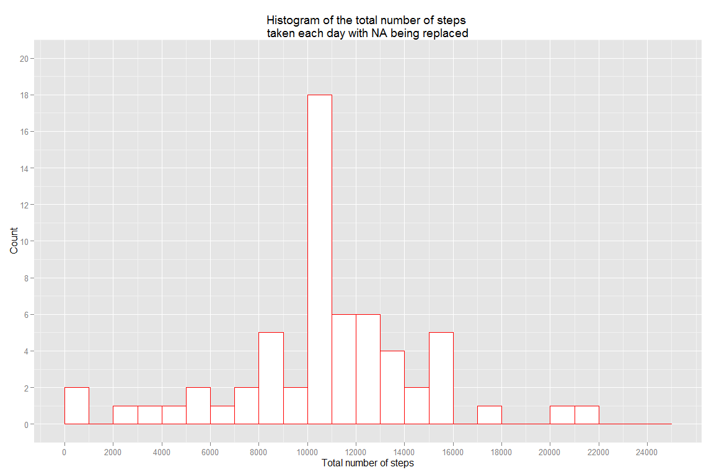

# Reproducible Research: Peer Assessment 1
Sunday, August 16, 2015  


```r
knitr::opts_chunk$set(fig.width=12, fig.height=8, echo=TRUE, warning=FALSE, message=FALSE, fig.path='figure/')
```


## Loading and preprocessing the data

```r
activityFile <- unzip("activity.zip")
activity <- read.csv(activityFile)
activityNoNA <- na.omit(activity)
```


## What is mean total number of steps taken per day?

```r
library(plyr)
library(dplyr)

## setting na.rm=TRUE in activity only fill NA steps with 0
## instead activityNoNA has all the observations with NA steps removed
stepsPerDayTotal <- ddply(activityNoNA, c("date"), summarize, total = sum(steps))
summary(stepsPerDayTotal)
```

```
##          date        total      
##  2012-10-02: 1   Min.   :   41  
##  2012-10-03: 1   1st Qu.: 8841  
##  2012-10-04: 1   Median :10765  
##  2012-10-05: 1   Mean   :10766  
##  2012-10-06: 1   3rd Qu.:13294  
##  2012-10-07: 1   Max.   :21194  
##  (Other)   :47
```

```r
meanTotal <- mean(stepsPerDayTotal$total)
medianTotal <- median(stepsPerDayTotal$total)
sprintf("mean and median total number of steps per day are %.1f and %.1f", meanTotal, medianTotal)
```

```
## [1] "mean and median total number of steps per day are 10766.2 and 10765.0"
```


**Plotting the histogram**

```r
library(ggplot2)

g <- ggplot(stepsPerDayTotal, aes(x=total))
binsize <- 5000
theplot <- g + geom_histogram(binwidth=binsize, fill="white", color="red", origin=0)
theplot <- theplot + xlab("Total number of steps") + ylab("Count") + ggtitle("Histogram of the total number\n of steps taken each day")
theplot <- theplot + scale_y_continuous(limits=c(0, 30), breaks=seq(0,30,5))
print(theplot)
```

 


## What is the average daily activity pattern?

```r
by_interval <- group_by(activityNoNA, interval)
stepsPerIntervalAvg <- dplyr::summarize(by_interval, avg = mean(steps))

## find out the interval time with the maximum number of steps
intervalMax <- which(stepsPerIntervalAvg$avg == max(stepsPerIntervalAvg$avg))
intervalTime <- stepsPerIntervalAvg$interval[intervalMax]
print(paste("The interval time with the maximum number of steps is ", intervalTime))
```

```
## [1] "The interval time with the maximum number of steps is  835"
```
**Plotting a time series pattern**

```r
g <- ggplot(stepsPerIntervalAvg, aes(x=interval, y=avg))
theplot <- g + geom_line(color="black") + xlab("Interval") + ylab("Average number of steps") + ggtitle("A time series plot across all days")
theplot <- theplot + annotate("rect", xmin=800, xmax=900, ymin=0, ymax=225, alpha=.1,fill="red")
theplot <- theplot + annotate("text", x=1500, y=180, label="maximum number of steps\nat the interval 835 ")
print(theplot)
```

 


## Imputing missing values
- make a copy of the dataset first
- use the mean for the same 5-minute interval to fill in the steps with NAs


```r
NAsteps <- filter(activity, is.na(steps))
print(paste("The number of records with missing values is ", nrow(NAsteps)))
```

```
## [1] "The number of records with missing values is  2304"
```

```r
activityCopy <- activity
criteria <- is.na(activityCopy$steps) & activityCopy$interval == stepsPerIntervalAvg$interval
activityCopy[criteria, c("steps")] <- stepsPerIntervalAvg$avg
stepsPerDayTotalCopy <- ddply(activityCopy, c("date"), summarize, total = sum(steps))
summary(stepsPerDayTotalCopy)
```

```
##          date        total      
##  2012-10-01: 1   Min.   :   41  
##  2012-10-02: 1   1st Qu.: 9819  
##  2012-10-03: 1   Median :10766  
##  2012-10-04: 1   Mean   :10766  
##  2012-10-05: 1   3rd Qu.:12811  
##  2012-10-06: 1   Max.   :21194  
##  (Other)   :55
```

```r
meanTotal <- mean(stepsPerDayTotalCopy$total)
medianTotal <- median(stepsPerDayTotalCopy$total)
sprintf("mean and median total number of steps per day are %.1f and %.1f", meanTotal, medianTotal)
```

```
## [1] "mean and median total number of steps per day are 10766.2 and 10766.2"
```
**The Observation:**  

1.mean and median values are almost the same as the ones without NA steps being replaced  
2.The values for the first quarter and the 3rd quarter, however, are different


**Plotting the histogram with NA steps being replaced**

```r
g <- ggplot(stepsPerDayTotalCopy, aes(x=total))
binsize <- 5000
theplot <- g + geom_histogram(binwidth=binsize, fill="white", colour="red", origin=0)
theplot <-  theplot + xlab("Total number of steps") + ylab("Count") + ggtitle("Histogram of the total number of steps \ntaken each day with NA being replaced")
theplot <- theplot + scale_x_continuous(breaks=seq(0, 30000, 5000)) +  scale_y_continuous(limits=c(0,40), breaks=seq(0, 50, 5)) 
print(theplot)
```

 


## Are there differences in activity patterns between weekdays and weekends?
**YES. It shows on the plot that the average number of steps taken roughly between 1000 and 1750 are higher on weekends.**


```r
library(lubridate)
daysOfWeek <- as.factor(c("weekend", "weekday","weekday","weekday","weekday","weekday", "weekend"))
activityCopy <- mutate(activityCopy, daytype = daysOfWeek[wday(date)])
stepsBydaytype <- ddply(activityCopy, c("daytype","interval"), summarize, avg = mean(steps))

g <- ggplot(stepsBydaytype, aes(x=interval, y=avg))
theplot <- g + geom_line(color="red") + labs(x="Interval", y="Average number of steps") + facet_wrap(~daytype, nrow=2)
theplot <- theplot + scale_x_continuous(limits=c(0,2355), breaks=seq(0, 2355, 250))
print(theplot)
```

 
